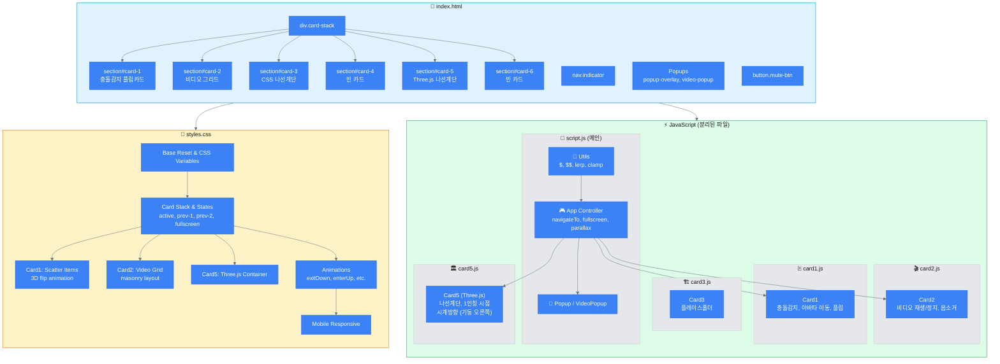

---

# 📁 프로젝트 구조

```
project/
├── index.html          # 메인 HTML (모든 카드 구조)
├── styles.css          # 통합 스타일시트
├── script.js           # 메인 컨트롤러 (Utils, App, Popup, VideoPopup)
├── card1.js            # Card1: 충돌 감지 플립 카드
├── card2.js            # Card2: 비디오 그리드
├── card3.js            # Card3: CSS 나선 계단 (플레이스홀더)
├── card5.js            # Card5: Three.js 나선 계단
├── Image/
│   └── human.jpg       # Card1 아바타 이미지
└── Video/
    ├── vid1.mp4 ~ vid6.mp4
```

### 스크립트 로드 순서
```html
<!-- 1. Card 모듈 먼저 로드 (window에 등록) -->
<script src="card1.js"></script>
<script src="card2.js"></script>
<script src="card3.js"></script>
<script src="card5.js"></script>
<!-- 2. 메인 컨트롤러 마지막 (DOMContentLoaded에서 init 호출) -->
<script src="script.js"></script>
```

---

# 🔄 모듈 간 통신

```
┌─────────────────────────────────────────┐
│  card1.js → window.Card1               │
│  card2.js → window.Card2               │
│  card3.js → window.Card3               │
│  card5.js → window.Card5               │
└─────────────┬───────────────────────────┘
              │ (window 전역 객체로 공유)
              ▼
┌─────────────────────────────────────────┐
│  script.js                              │
│  ├── var Utils   (전역 유틸리티)        │
│  ├── var Popup   (일반 팝업)            │
│  ├── var VideoPopup (비디오 팝업)       │
│  └── var App     (메인 컨트롤러)        │
│                                         │
│  DOMContentLoaded:                      │
│    App.init()                           │
│    Card1.init()  ← Utils 참조 가능     │
│    Card2.init()  ← Utils 참조 가능     │
│    Card5.init()  ← Utils, VideoPopup   │
└─────────────────────────────────────────┘
```

---

# 🎯 Card5 카메라 시점

```
        [기둥]
          ●
         /|
        / |
       /  |
      /   |
     📷───→ 시선 방향 (시계 방향 앞)
    카메라
    
ANGLE_PER_STAIR: -24 (시계 방향)
→ 카메라 기준 기둥이 오른쪽에 위치
→ 시선은 시계 방향 2.5계단 앞을 바라봄
```

---

# 📝 수정사항 요약

| 항목 | 변경 전 | 변경 후 |
|------|---------|---------|
| 파일 구조 | app.js (단일 파일) | script.js + card1~5.js (분리) |
| Card5 카메라 방향 | 기둥 왼쪽 (ANGLE: +24) | **기둥 오른쪽 (ANGLE: -24)** |
| 모듈 통신 | IIFE 내부 참조 | window 전역 객체 |
